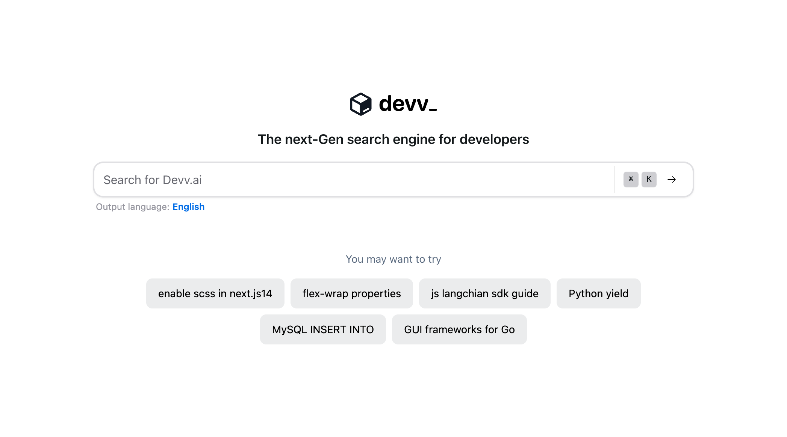

# Devv AI

[English](./README.md) | [简体中文](./README_CN.md)

**Devv AI is an AI-powered search engine specifically designed for developers, providing fast and accurate results to programming-related queries.**

This is an issues-only repository for [Devv AI](https://devv.ai). Please use this repository to:

- Report bugs
- Request new features
- Ask questions
- Provide feedback

We highly appreciate your contributions in creating new tickets for bugs or feature requests. To help us better understand and address your concerns, please provide as much detail as possible when submitting a new ticket. Our goal is to make Devv AI an indispensable tool for developers, and your feedback is essential to achieving this objective.

## Getting Started

1. Visit [Devv AI](https://devv.ai)
2. Enter your search query related to programming, frameworks, libraries, or tools
3. Browse through the search results and find the most relevant information

## Key Features

- AI-powered search engine tailored for developers
- Fast and accurate search results
- Supports various programming languages and frameworks
- Continuously learning and improving based on user interactions

## Upcoming Features

We are actively working on expanding Devv AI's capabilities. Some of the features in our pipeline include:

- [x] Support for additional languages, such as Japanese, Chinese, and Korean
- [x] Agent mode for real-time coding assistance
- [ ] Enhanced user experience for searching and navigating results
- [ ] Integration with popular developer tools and platforms

## Roadmap

We are currently in the process of defining our roadmap. Stay tuned for updates on our short-term and long-term goals, milestones, and timelines.

## Contributing

We welcome contributions from the developer community to help improve Devv AI. If you encounter any bugs, have feature requests, or want to provide feedback, please create a new issue in this repository. We appreciate your valuable input!

## Contact

If you have any questions or need further assistance, feel free to reach out to us at [support@devv.ai](mailto:support@devv.ai).

Happy coding with Devv AI!
