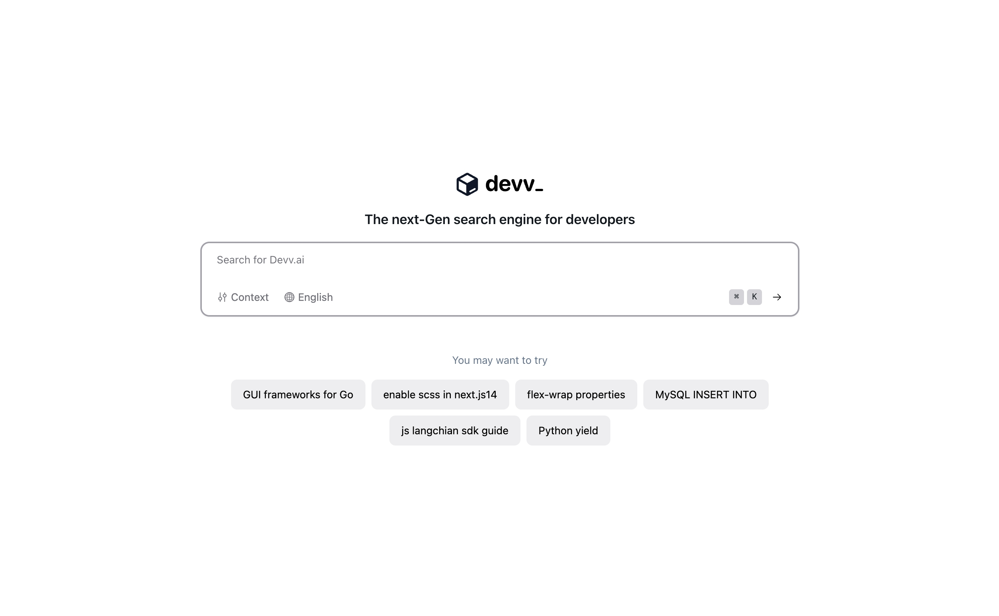

# Devv AI

[English](./README.md) | [简体中文](./README_CN.md)

**Devv AI is an AI-powered search engine for developers.**

This is an issues-only repository for [Devv AI](https://devv.ai). Please use this repository to report bugs, request features, or ask questions.

Creating new tickets for bugs or feature requests is much appreciated! Please be as detailed as possible when creating a new ticket. Our goal is to make Devv AI as useful as possible for developers, and your feedback is critical to that goal.

## Getting Started

Go to [Devv AI](https://devv.ai) and start searching!

## Features

It's early days for Devv AI, but here are some of the features we're working on:

- More language support, including Japanese, Chinese, and Korean
- Copilot mode
- Searching user experience improvements

## Roadmap

TBD

## OSS

We will open source the base version of Devv AI in the future. Stay tuned!
