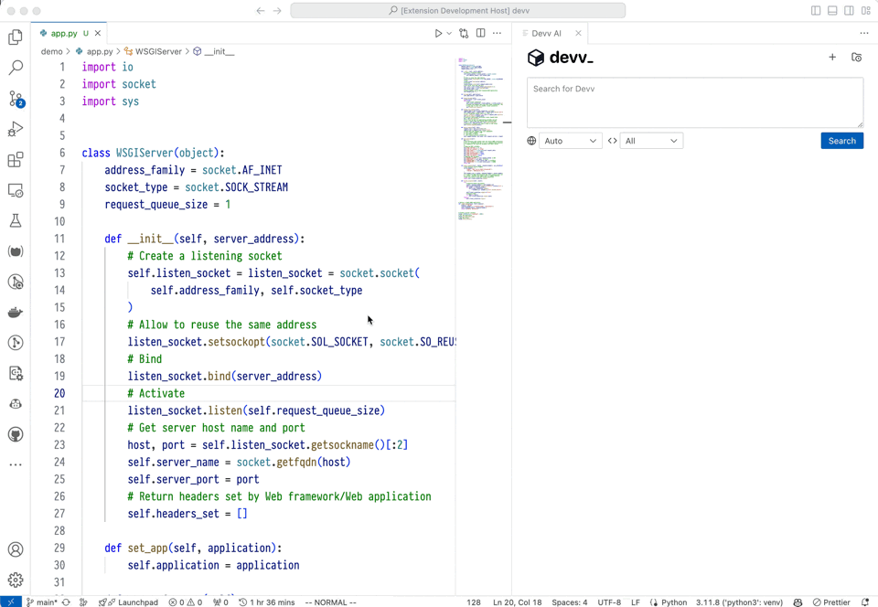

# Devv.AI - Free AI Coding Assistant for VSCode

Devv VSCode Extension brings the power of [Devv.AI](https://devv.ai), an AI-powered search engine for developers, directly into your Visual Studio Code editor.

## Key Features

- **AI-Powered Chat**: Get instant answers to coding questions using `Ctrl+Shift+K`
- **Vertical Search Index**: Access curated development resources, including official docs and relevant code snippets
- **Multiple AI Models**: Leverage GPT-4, Claude 3.5, and Gemini for diverse capabilities
- **Free to Use**: No cost access to advanced AI assistance

## Quick Start

1. Install the Devv VSCode Extension
2. Use `Ctrl+Shift+K` or type "Chat with Devv AI" in the command palette
3. Start asking questions or requesting code snippets

## Why Devv?

- **Developer-Focused**: Tailored specifically for programming challenges
- **Real-Time Accuracy**: More up-to-date than traditional AI chatbots
- **Source Attribution**: Responses cite Stack Overflow, technical docs, and other reliable sources

## Privacy & Security

- Your codebase is never shared or stored
- Only user-submitted code snippets are processed for responses

## Web Version

For additional features, visit [Devv.AI](https://devv.ai) in your browser.

## Feedback & Support

- Submit feedback: [Devv Hub](https://hub.devv.ai)
- Email support: support@devv.ai
- Twitter: [@devv_ai](https://twitter.com/devv_ai)
- Changelog: [Changelog](https://hub.devv.ai/changelog)

Experience the future of AI-assisted coding with Devv VSCode Extension!
