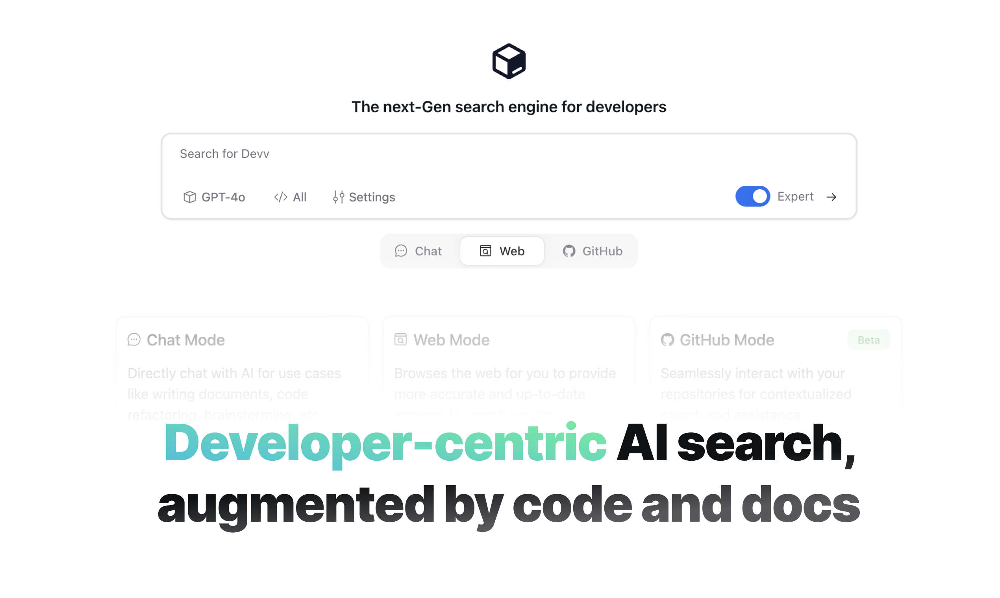

# Devv.AI - 免费的 VSCode AI 编码助手

[English](./VSCode_README.md) | [日本語](./VSCode_README_JP.md)

Devv VSCode 扩展将 [Devv.AI](https://devv.ai) 的强大功能直接带入您的 Visual Studio Code 编辑器，这是一个为开发者设计的 AI 驱动搜索引擎。

## 主要功能

- **AI 驱动的聊天**：使用 `Ctrl+Shift+K` 获取即时编码问题答案
- **垂直搜索索引**：访问精选的开发资源，包括官方文档和相关代码片段
- **多种 AI 模型**：利用 GPT-4、Claude 3.5 和 Gemini 提供多样化的能力
- **免费使用**：免费访问高级 AI 帮助

## 快速开始

1. 安装 Devv VSCode 扩展
2. 使用 `Ctrl+Shift+K` 或在命令面板中输入 "Chat with Devv AI"
3. 开始提问或请求代码片段

## 为什么选择 Devv？

- **开发者专注**：专为编程挑战量身定制
- **实时准确性**：比传统 AI 聊天机器人信息更为及时
- **来源归属**：响应引用 Stack Overflow、技术文档和其他可靠来源

## 隐私与安全

- 您的代码库不会被共享或存储
- 仅处理用户提交的代码片段以生成响应

## Web 版本

欲了解更多功能，请访问浏览器中的 [Devv.AI](https://devv.ai)。

## 反馈与支持

- 提交反馈：[Devv Hub](https://hub.devv.ai)
- 电子邮件支持：support@devv.ai
- 推特：[devv_ai](https://twitter.com/devv_ai)
- 更新日志：[更新日志](https://hub.devv.ai/changelog)

体验 Devv VSCode 扩展带来的 AI 辅助编码未来！
