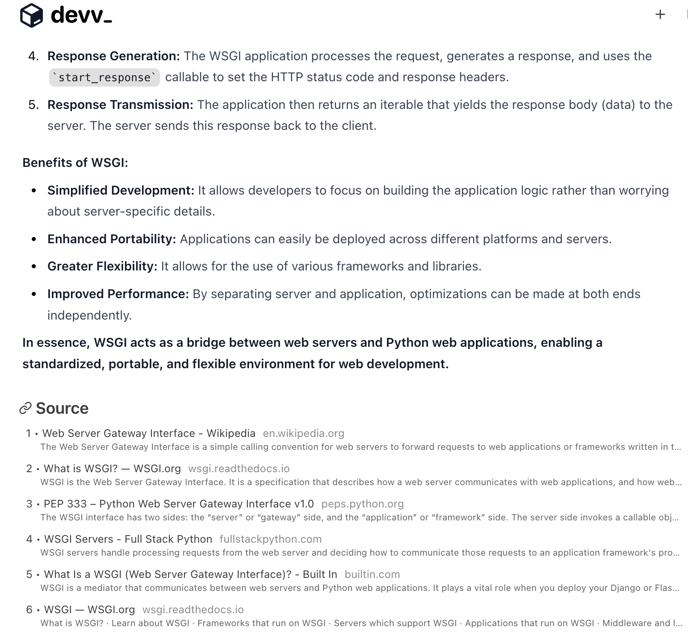

# Devv.AI - 無料の VSCode AI コーディングアシスタント

Devv VSCode 拡張機能は、開発者向けの AI 駆動検索エンジン [Devv.AI](https://devv.ai) の強力な機能を Visual Studio Code エディターに直接もたらします。

## 主な機能

- **AI 駆動のチャット**：`Ctrl+Shift+K` を使用してコーディングの質問に即座に回答
- **垂直検索インデックス**：公式ドキュメントや関連するコードスニペットを含む厳選された開発リソースにアクセス
- **複数の AI モデル**：GPT-4、Claude 3.5、Gemini を活用して多様な能力を提供
- **無料で使用可能**：高度な AI 支援を無料で利用可能

## クイックスタート

1. Devv VSCode 拡張機能をインストール
2. `Ctrl+Shift+K` を使用するか、コマンドパレットで「Chat with Devv AI」と入力
3. 質問を始めるか、コードスニペットをリクエスト

## なぜ Devv を選ぶのか？

- **開発者に特化**：プログラミングの課題に特化して設計
- **リアルタイムの正確性**：従来の AI チャットボットよりも最新
- **ソースの帰属**：回答には Stack Overflow、技術ドキュメント、その他の信頼できるソースを引用

## プライバシーとセキュリティ

- あなたのコードベースは共有または保存されません
- ユーザーが送信したコードスニペットのみが回答のために処理されます

## Web バージョン

追加機能については、ブラウザで [Devv.AI](https://devv.ai) をご覧ください。

## フィードバックとサポート

- フィードバックの提出：[Devv Hub](https://hub.devv.ai)
- メールサポート：support@devv.ai
- Twitter：[devv_ai](https://twitter.com/devv_ai)
- 変更履歴：[変更履歴](https://hub.devv.ai/changelog)

Devv VSCode 拡張機能で AI 支援コーディングの未来を体験してください！
